# Firewalk

O Firewalk é um sistêma que permite que o usuário adicione treinos, atualize-os, filtre e receba recomendações, além de acompanhar metas e desafios com base no seu histórico.

## Funcionalidades
**Cadastro e visualização de Treinos e Competições**: permite que o usuário registre seus treinos e visualize-os, além de possibilitar que sejam adicionadas informações como a data, a duração, condições climáticas, quilometro percorrido e localização.

**Filtragem por Distância ou tempo**: Permite que o usuário filtre seus treinos com base na distância ou tempo informados, ajudando-o a acompanhar seu desenvolvimento.

**Armazenamento de Dados**: Permite que as informações dos treinos inseridas pelo usuário sejam armazenadas no sistema, facilitando o acesso aos dados previamente adicionados.

**Metas e Desafios**: Permite que o usuário insira desafios pessoais, e possibilita o acompanhamento da sua evolução.

**Sugestão de Treinos Aleatórios**: O sistema oferece ao usuário propostas de treino aleatórias, com base no seu histórico de atividades.

**Cálculo de IMC e Sugestão de Dietas e Treinos**: Como funcionalidade extra, o  sistema informa o usuário uma série de recomendações de treinos e dietas, com base no cálculo do seu *Indice de massa corporal*.

## Como funciona?
### Menu principal:
O menu principal é disponibilizado de forma intuitiva, mostrando ao usuário as opções de funcionalidade disponíveis no sistema.

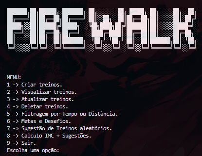

### Adicionar treinos:

Ao escolher a opção 1, as informações do treino são adiconadas pelo usuário (como data, distância, localização e etc). Os dados são armazenados no arquivo (csv).

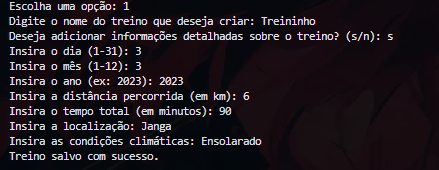

### Visualizar treinos:

Ao escolher a opção 2, as informações dos treinos armazenados pelo sistema serão visíveis ao usuário.

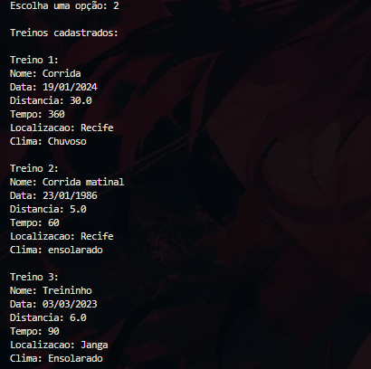

### Atualizar treinos:

Ao escolher a opção 3, o sistema permite que o usuário realize alterações em dados específicos do treino adicionado.

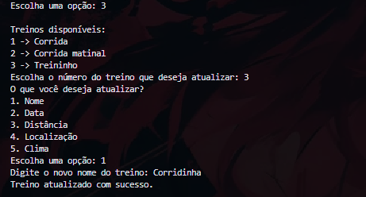

### Deletar treinos:

Ao escolher a opção 4, o sistema percorre os treinos adicionados e deleta o treino informado pelo usuário.

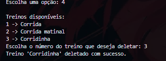

### Filtragem de treinos:

Ao escolher a opção 5, o usuário deve escolher os parâmetros da filtragem, como por exemplo, definir que tipo de filragem deseja realizar, tempo ou distância, e definir os limites da filtragem, como distância máxima e mínima.

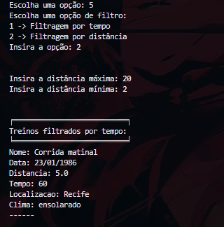

### Metas e desafios:
#### Adicionar metas:

Ao escolher a opção 6, e dentro desta opção, selecionar "Definir Metas", o sistema permite que o usuário defina metas pessoais.

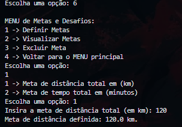

#### Visualizar metas:

Ao selecionar "Visualizar Metas", o sistema apresenta ao usuário as metas previamente adicionadas.

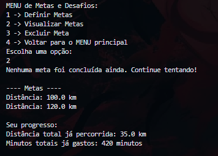

#### Excluir metas:

Ao selecionar "Excluir metas", o sistema apresenta as metas adicionadas e permite que o usuário escolha qual meta quer adicionar.

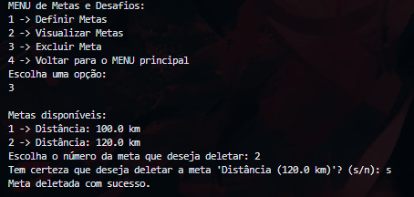

#### Voltar ao menu principal:

Ao selecionar "Voltar ao menu principal", o usuário é levado de volta para a tela inicial.

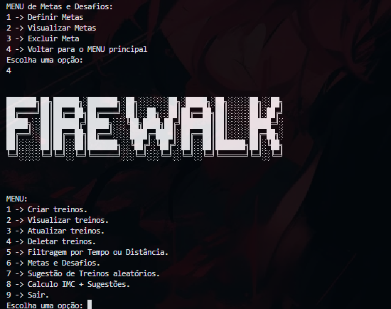

### Cálculo IMC e sugestões de dieta:

Ao escolher a opção 9, O sistema pede ao usuário informações como peso e altura, para calcular seu Indice de Massa Corporal, e com base nele, sugerir dietas e exercícios com intuito de contribuir para a melhora dos seus resultados.

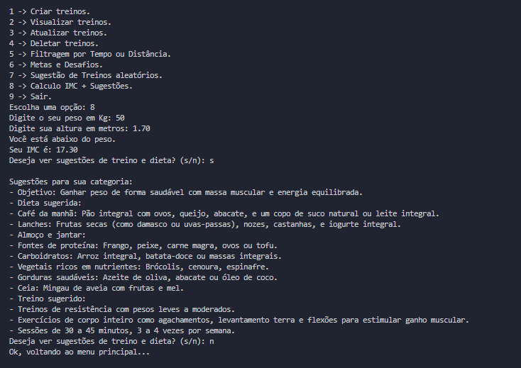

## Integrantes

| Nome | Turma | Email institucional|
|------|-------|------------|
|Augusto Malheiros| A | ams10@cesar.school|
|Brenda Luana| A | blcb@cesar.school|
|Eduardo Albuquerque| A | eaab@cesar.school|
|Heloísa Barros| A | hbbs@cesar.school|

# Link para o fluxograma:
[fluxograma.](https://miro.com/welcomeonboard/QklTUEtBTjhpV1MrZVp2RGRxQXA5RHE5NjFaWFJ2OHpVeGpNTlJybHo0R0FsUEsxZ09lZjJTeTFuNXpYVFZLNzhUK1FWK1ZkTUJhMDF2SzBVdmJ0ZlJKSzBGc2VKVTNBMkk3bWF5QUY5bThxVUtFTERYVnpWK1lyZW0yTVFtczUhZQ==?share_link_id=540843250254)